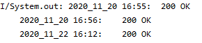

### HTTPCodeAnalysis was created to track http request and save it for future debug, the user have to choose which stream he want to save it.
[](https://jitpack.io/#LeonGrn/HttpCodeAnalysis)
[](https://opensource.org/licenses/Apache-2.0)
### Download
 ### Requirement
```
 minSdkVersion 23
```
### Repository
Add this in your root build.gradle file (not your module build.gradle file):
```
allprojects {
 repositories {
  ...
  maven { url "https://jitpack.io" }
 }
}
```
### Dependency
Add this to your module's build.gradle file (Note: version should match the jitpack badge above)
```
dependencies {
 implementation 'com.github.LeonGrn:HttpCodeAnalysis:1.0.0'
}
```
### Usage (for this example i will choose to save the results to file)
```
First lets initialize the objects
    HttpCode myHttp;
    PrintWriter pw;
    File file;
```
#### Now lets create an instance for each one
```
    String filePath = this.getFilesDir().getPath().toString() + "/HTTPCODE1.txt";
    file = new File(filePath);

    try {
        pw = new PrintWriter(new FileOutputStream(
                file,
                true /* append = true */));
        myHttp = new HttpCode(pw);
    } catch (FileNotFoundException e) {
        e.printStackTrace();
    }
```
#### Create http request and capture the code
#### Paste the code in the function CheckHttpCode
     myHttp.CheckHttpCode(mStatusCode);
#### After it you can read it from the file
     try {
         BufferedReader br = new BufferedReader(new FileReader(file));
         String st;
         while ((st = br.readLine()) != null)
             System.out.println(st);
     }
     catch (FileNotFoundException e) {
         e.printStackTrace();
     }
     catch (IOException e) {
         e.printStackTrace();
     }
     
#### Example 
output to file with date & time


